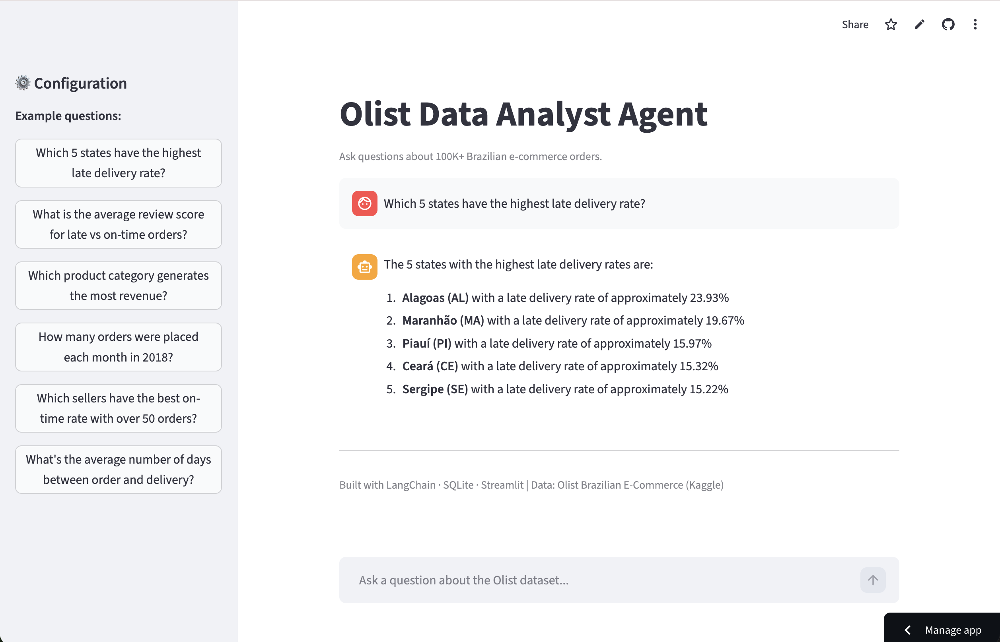

# E-Commerce Analytics Agent


A conversational AI agent that lets you query 100,000+ Brazilian e-commerce orders in plain English. No SQL required.

🔗 **Live Demo: [olist-agent.streamlit.app](https://olist-agent.streamlit.app/)** *(may take ~30 seconds to wake up on first load)*

---

## Project Background

Exploratory data analysis on large relational datasets typically requires writing SQL, a barrier for business users who need answers quickly. This project explores whether an LLM-powered agent can bridge that gap by translating plain-English questions into SQL queries, executing them against a real e-commerce database, and returning natural language answers.

Built on the [Olist Brazilian E-Commerce dataset](https://www.kaggle.com/datasets/olistbr/brazilian-ecommerce) (~100,000 orders across 8 relational tables spanning 2016 to 2018), the agent handles multi-table queries, aggregations, and filtering without the user writing a single line of SQL.

The EDA notebook used to explore the dataset prior to building the agent, covering late delivery rates, review score impact, delay distribution, category revenue, and seller reliability, can be found [here](olist_ecom_eda.ipynb).

---

## How It Works

The agent accepts natural language questions, generates the appropriate SQL query, executes it against the Olist database, and returns a natural language answer. Users can expand any response to inspect the underlying SQL query that was run.



**Example questions:**
- Which 5 states have the highest late delivery rate?
- What is the average review score for late vs on-time orders?
- Which product category generates the most revenue?
- How many orders were placed each month in 2018?
- Which sellers have the best on-time rate with over 50 orders?
- What's the average number of days between order and delivery?

---

## Tech Stack

| Layer | Tool |
|---|---|
| Frontend | Streamlit |
| Agent | LangChain SQL Agent |
| LLM | GPT-4o (OpenAI) |
| Database | SQLite (`olist.db`) |
| Data | [Olist Brazilian E-Commerce — Kaggle](https://www.kaggle.com/datasets/olistbr/brazilian-ecommerce) |

---

## Data Structure

The Olist dataset contains ~100,000 orders made across multiple marketplaces in Brazil, covering order status, pricing, payment, freight performance, customer location, product attributes, and customer reviews.

Tables used: `orders`, `order_items`, `order_reviews`, `order_payments`, `customers`, `products`, `sellers`, `category_translation`.

---

## Running Locally

**1. Clone the repo**
```bash
git clone https://github.com/rafiamb/ecommerce-analytics-agent.git
cd ecommerce-analytics-agent
```

**2. Install dependencies**
```bash
pip install -r requirements.txt
```

**3. Add your OpenAI API key**

Create a `.env` file in the project root:
```
OPENAI_API_KEY=sk-...
```

**4. Run the app**
```bash
streamlit run app.py
```

---

## Project Structure

```
├── app.py               # Main Streamlit app
├── olist_ecom_eda.ipynb # EDA notebook: delivery performance, category revenue, seller reliability
├── olist.db             # SQLite database (built from Olist dataset)
├── requirements.txt     # Python dependencies
├── .env                 # API keys (not committed)
└── README.md
```

---

## Deployment

Deployed on [Streamlit Community Cloud](https://streamlit.io/cloud). To deploy your own instance:

1. Push this repo to GitHub
2. Go to [share.streamlit.io](https://share.streamlit.io) and connect your repo
3. Add `OPENAI_API_KEY` under **Advanced settings → Secrets**
4. Click **Deploy**

---

## License

MIT License
